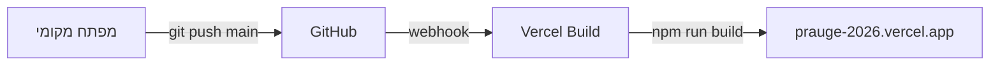

# מדריך פרויקט – אתר טיול משפחתי

> **מטרת הקובץ:** מסמך הסבר ל-AI ולמפתחים. כשמשכפלים את הריפו לטיול/יעד חדש — קראו קובץ זה לפני שינויי קוד.

**ריפו נוכחי:** `prauge-hamam-2026`  
**פרודקשן:** https://prauge-2026.vercel.app  
**GitHub:** https://github.com/pasmant/prauge-hamam-2026

---

## 1. מה זה?

אתר Next.js בעברית (RTL) לטיול משפחתי. מציג:

- דף בית עם ספירה לאחור, מזג אוויר, "היום בטיול"
- טיסות, מלון, מסעדות, תוכנית יומית, מפה, ציוד, גalerיה
- רשימת משפחות (Supabase) + ניהול הודעות רצות (`/admin`)
- הורדת PDF של התוכנית המלאה

**רוב התוכן סטטי** בקבצי TypeScript בתיקיית `data/`.  
**תוכן דינמי** (משפחות, גalerיה, ticker) ב-Supabase — אופציונלי אך מומלץ.

---

## 2. Development Stack

| שכבה | טכנולוגיה | גרסה (נכון ליוני 2026) |
|------|-----------|-------------------------|
| Framework | **Next.js** (App Router) | 16.x |
| UI | **React** | 19.x |
| שפה | **TypeScript** | 5.x |
| עיצוב | **Tailwind CSS** v4 | + `tw-animate-css` |
| קומפוננטות | **shadcn/ui** + **Base UI** | `@/components/ui/` |
| אנימציות | **Framer Motion** | |
| אייקונים | **Lucide React** | |
| פונטים (אתר) | **Heebo** + **Assistant** (Google Fonts) | `app/layout.tsx` |
| DB / Storage | **Supabase** | PostgreSQL + Storage |
| PDF | **Puppeteer Core** + **@sparticuz/chromium-min** | שרת בלבד |
| Deploy | **Vercel** | auto-deploy מ-`main` |
| Git | **GitHub** | branch `main` |

### הערות חשובות ל-AI

- **Next.js 16** — יש שינויים breaking. לפני כתיבת קוד Next.js, קראו `node_modules/next/dist/docs/` (ראו גם `AGENTS.md`).
- האתר **RTL מלא**: `lang="he"` `dir="rtl"` ב-`app/layout.tsx`.
- רוב הדפים הם **Client Components** (`"use client"`) בגלל אנימציות ו-Supabase.

---

## 3. מבנה תיקיות

```
prauge-hamam-2026/
├── app/                          # Next.js App Router
│   ├── layout.tsx                # Root layout, metadata, fonts, Navbar/Footer
│   ├── page.tsx                  # דף בית
│   ├── flights/ hotel/ restaurants/ itinerary/ map/ packing/ group/ gallery/
│   ├── families/                 # משפחות – Supabase CRUD
│   ├── admin/                    # ניהול ticker (סיסמה client-side)
│   ├── day/[id]/                 # פירוט יום בודד
│   └── api/
│       ├── itinerary-pdf/        # GET → PDF (Puppeteer)
│       └── flight-status/        # GET → AviationStack proxy
│
├── components/
│   ├── home/                     # Hero, Countdown, Weather, Today, Ticker...
│   ├── layout/                   # Navbar, BottomNav, Footer
│   ├── itinerary/                # DownloadItineraryPdfButton
│   └── ui/                       # shadcn (Button וכו')
│
├── data/                         # ★ תוכן סטטי – כאן משנים ליעד חדש
│   ├── itinerary.ts              # תוכנית 5 ימים (הקובץ הגדול ביותר)
│   ├── flights.ts
│   ├── hotel.ts
│   ├── restaurants.ts
│   ├── packing.ts
│   ├── group.ts                  # תאריכים, יעד, WhatsApp, חירום
│   └── tourMapData.ts
│
├── lib/
│   ├── generateItineraryPdf.ts   # Puppeteer → buffer
│   ├── itineraryPrintHtml.ts     # HTML להדפסה/PDF
│   ├── supabase.ts               # Supabase client
│   ├── weather.ts                # WeatherAPI.com
│   └── utils.ts                  # cn() – Tailwind merge
│
├── supabase/
│   └── migrations/               # SQL schema + seed
│
├── public/                       # קבצים סטטיים (SVG, PDF מפה...)
├── next.config.ts
├── vercel.json                   # timeout/memory ל-PDF API
└── PROJECT-SETUP.md              # ← הקובץ הזה
```

---

## 4. דפים ונתיבים

| נתיב | קובץ | מקור נתונים |
|------|------|-------------|
| `/` | `app/page.tsx` | `data/*` + Supabase (ticker) + Weather API |
| `/flights` | `app/flights/page.tsx` | `data/flights.ts` |
| `/hotel` | `app/hotel/page.tsx` | `data/hotel.ts` |
| `/restaurants` | `app/restaurants/page.tsx` | `data/restaurants.ts` |
| `/itinerary` | `app/itinerary/page.tsx` | `data/itinerary.ts` |
| `/day/[id]` | `app/day/[id]/page.tsx` | `data/itinerary.ts` |
| `/map` | `app/map/page.tsx` | `data/tourMapData.ts` |
| `/packing` | `app/packing/page.tsx` | `data/packing.ts` |
| `/group` | `app/group/page.tsx` | `data/group.ts` |
| `/gallery` | `app/gallery/page.tsx` | Supabase `gallery_photos` |
| `/families` | `app/families/page.tsx` | Supabase `families` |
| `/admin` | `app/admin/page.tsx` | Supabase `ticker_messages` |

ניווט: `components/layout/Navbar.tsx` + `BottomNav.tsx` (מובייל).

---

## 5. שכבת הנתונים

### 5.1 קבצים סטטיים (`data/`)

**זה המקום העיקרי לשינוי יעד.** אין DB — עורכים TypeScript ישירות.

| קובץ | מה לעדכן ליעד חדש |
|------|-------------------|
| `group.ts` | תאריכים, יעד, מלון, מספר משתתפים, קישור WhatsApp, אנשי קשר חירום |
| `flights.ts` | טיסות הלוך/חזור, שעות, מספרי טיסה, reference |
| `hotel.ts` | שם מלון, כתובת, קישורים, תיאור |
| `itinerary.ts` | כל התוכנית: ימים, timeline, טיפים, אפשרויות יום חופשי |
| `restaurants.ts` | מסעדות מומלצות |
| `packing.ts` | רשימת ציוד |
| `tourMapData.ts` | נקודות על מפה, embed URLs |

**ממשקים ב-`itinerary.ts`:** `DayPlan`, `TimelineItem`, `TimelineBranch`, `FreeDayOption` — שמרו על המבנה.

### 5.2 Supabase (דינמי)

**טבלאות:** `families`, `gallery_photos`, `ticker_messages`  
**Storage bucket:** תמונות משפחות / גalerיה

מיגרציות: `supabase/migrations/*.sql`

**RLS:** קריאה ציבורית; כתיבה/מחיקה ציבורית (ללא auth אמיתי — מתאים לטיול פרטי, לא production רגיש).

**אם מדלגים על Supabase:** דפי `/families`, `/gallery`, `/admin` ו-ticker בדף הבית לא יעבדו. שאר האתר כן.

---

## 6. משתני סביבה

צרו `.env.local` (לא ב-git):

```bash
# Supabase (חובה ל-families/gallery/admin/ticker)
NEXT_PUBLIC_SUPABASE_URL=https://xxxx.supabase.co
NEXT_PUBLIC_SUPABASE_ANON_KEY=eyJ...

# מזג אוויר (אופציונלי – WeatherWidget + lib/weather.ts)
NEXT_PUBLIC_WEATHER_API_KEY=

# סטטוס טיסה בזמן אמת (אופציונלי – /api/flight-status)
AVIATIONSTACK_API_KEY=

# PDF מקומי בלבד (אופציונלי)
PUPPETEER_EXECUTABLE_PATH=/Applications/Google Chrome.app/Contents/MacOS/Google Chrome

# PDF ב-Vercel (אופציונלי – ברירת מחדל: GitHub releases)
CHROMIUM_REMOTE_EXEC_PATH=
```

**ב-Vercel:** Project → Settings → Environment Variables — אותם משתנים.

---

## 7. פיתוח מקומי

```bash
git clone https://github.com/pasmant/prauge-hamam-2026.git
cd prauge-hamam-2026
npm install
cp .env.local.example .env.local   # אם קיים; אחרת צרו ידנית
npm run dev                         # http://localhost:3000
```

| פקודה | תיאור |
|-------|--------|
| `npm run dev` | שרת פיתוח (Turbopack) |
| `npm run build` | בניית production |
| `npm run start` | הרצה אחרי build |
| `npm run lint` | ESLint |

**PDF מקומי:** דורש Chrome/Chromium מותקן (macOS: Google Chrome).  
**PDF ב-Vercel:** Chromium מורד ב-runtime מ-GitHub releases (cold start ~20–30 שניות).

---

## 8. GitHub + Vercel – זרימת Deploy



1. קוד ב-**GitHub** (`main`)
2. **Vercel** מחובר לריפו — deploy אוטומטי בכל push ל-`main`
3. Build: `next build` — רוב הדפים static, API routes serverless
4. **PDF API** דורש הגדרות מיוחדות (ראו §9)

---

## 9. יצירת PDF (itinerary)

| קובץ | תפקיד |
|------|--------|
| `lib/itineraryPrintHtml.ts` | בונה HTML מ-`data/itinerary.ts` + `data/group.ts` |
| `lib/generateItineraryPdf.ts` | Puppeteer → PDF buffer |
| `app/api/itinerary-pdf/route.ts` | `GET` → קובץ PDF |
| `components/itinerary/DownloadItineraryPdfButton.tsx` | fetch + download בדפדפן |

**עיצוב PDF:**

- HTML + CSS RTL, פונט Rubik מ-Google Fonts
- דף שער + **כל יום בדף נפרד** (`page-break-before: always` על `.day`)
- עברית מעורבת עם אנגלית/מספרים — עובד כי זה render של Chrome, לא react-pdf

**Vercel (`vercel.json` + `next.config.ts`):**

- `maxDuration: 60`, `memory: 1024` ל-API
- `serverExternalPackages`: `puppeteer-core`, `@sparticuz/chromium-min`
- `@sparticuz/chromium-min` **לא** כולל binary — URL:
  `https://github.com/Sparticuz/chromium/releases/download/v149.0.0/chromium-v149.0.0-pack.{x64|arm64}.tar`

---

## 10. API Routes

### `GET /api/itinerary-pdf`

מחזיר PDF. ללא query params.

### `GET /api/flight-status?flight_iata=U8461`

Proxy ל-AviationStack. דורש `AVIATIONSTACK_API_KEY`. בלי מפתח — `{ available: false }`.

---

## 11. מזג אוויר

- `lib/weather.ts` — server-side, `q=Prague` (hardcoded)
- `components/home/WeatherWidget.tsx` — client, אותו API key

**ליעד חדש:** שנה את שם העיר ב-`lib/weather.ts` וב-WeatherWidget.

---

## 12. Admin

- נתיב: `/admin` (לא מקושר ב-navbar — URL ישיר)
- סיסמה: hardcoded ב-`app/admin/page.tsx` (`hamam2026admin`) — **שנו לטיול חדש**
- מנהל הודעות ticker ב-Supabase

---

## 13. Checklist: שכפול ליעד/טיול חדש

### שלב א — ריפו ופרויקט

- [ ] Fork / duplicate repo ב-GitHub
- [ ] `git clone` + `npm install`
- [ ] פרויקט Vercel חדש → Import מהריפo
- [ ] הגדרת env vars ב-Vercel

### שלב ב — תוכן (עדיפות גבוהה)

- [ ] `data/group.ts` — תאריכים, יעד, מלון, WhatsApp
- [ ] `data/flights.ts`
- [ ] `data/hotel.ts`
- [ ] `data/itinerary.ts` — התוכנית המלאה
- [ ] `data/restaurants.ts`, `data/packing.ts`, `data/tourMapData.ts`
- [ ] `app/layout.tsx` — `metadata.title`, `description`, `openGraph`
- [ ] `components/layout/Footer.tsx`, `Navbar.tsx` — טקסטים/אימוג'י אם רלוונטי
- [ ] `lib/weather.ts` — שם עיר
- [ ] `lib/itineraryPrintHtml.ts` — כותרת PDF אם שונה מה-metadata
- [ ] `app/admin/page.tsx` — סיסמת admin

### שלב ג — Supabase (אופציונלי)

- [ ] פרויקט Supabase חדש
- [ ] הרצת migrations מ-`supabase/migrations/`
- [ ] Storage bucket לתמונות
- [ ] עדכון seed / ניקוי נתוני דמו
- [ ] עדכון `.env.local` + Vercel env

### שלב ד — בדיקות

- [ ] `npm run build` עובר
- [ ] כל הדפים בעברית RTL
- [ ] `/itinerary` → הורדת PDF
- [ ] `/families`, `/gallery` (אם Supabase מוגדר)
- [ ] מובייל: BottomNav + תפריט

### שלב ה — Deploy

- [ ] `git push origin main`
- [ ] וידוא deploy ב-Vercel
- [ ] בדיקת `https://YOUR-PROJECT.vercel.app/api/itinerary-pdf`

---

## 14. הנחיות ל-AI שעובד על הפרויקט

1. **תוכן טיול** → ערכו `data/*.ts`, לא hardcode בקומפוננטות.
2. **עברית** → שמרו RTL; אל תשבירו `dir="rtl"` ב-layout.
3. **itinerary.ts** — קובץ גדול; עדכונים inline מועדפים על קבצי enrichment נפרדים.
4. **PDF** — אל תחזירו ל-`@react-pdf/renderer` (בעיות bidi); HTML+Puppeteer עובד.
5. **Next.js 16** — קראו docs לפני שימוש ב-API חדש.
6. **Commits** — רק כשהמשתמש מבקש במפורש.
7. **Deploy** — push ל-`main` מפעיל Vercel אוטומטית.

---

## 15. תלויות עיקריות (package.json)

```
next, react, react-dom          # core
tailwindcss, framer-motion      # UI
@supabase/supabase-js           # DB
puppeteer-core                  # PDF (server)
@sparticuz/chromium-min         # Chromium ל-Vercel
lucide-react, @base-ui/react    # icons + primitives
zustand                         # state (אם בשימוש)
```

---

## 16. קישורים שימושיים

- [Next.js Docs](https://nextjs.org/docs)
- [Vercel Dashboard](https://vercel.com/dashboard)
- [Supabase Dashboard](https://supabase.com/dashboard)
- [Sparticuz Chromium Releases](https://github.com/Sparticuz/chromium/releases)
- [WeatherAPI](https://www.weatherapi.com/)
- [AviationStack](https://aviationstack.com/)

---

*עודכן: יוני 2026 | פרויקט: טיול משפחתי פראג (Hamam)*
